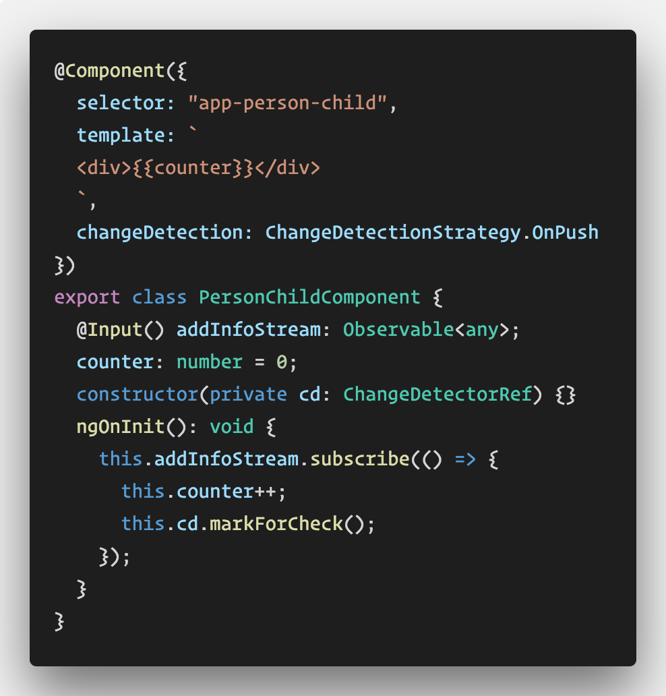

# Angular Change Detection 

Angular的应用程序是一颗组件树，每一个组件都有自己的变化检测器，这意味着应用程序也是一颗变化检测树。 Angular 2 编译器为每个组件自动创建变化检测器，而且最终生成的这些代码是对VM友好的。但是Angular也有自己的Change Detection。

## 变化监测是什么？

变更检测的基本任务是获取程序的内部状态并使其在用户界面中以某种方式可见。这种状态可以是任何类型的对象，数组，基元，......任何类型的JavaScript数据结构。这种状态最终可能是用户界面中的段落，表单，链接或按钮，特别是在Web上，它是文档对象模型（DOM）。所以基本上我们将数据结构作为输入并生成DOM输出以将其显示给用户。我们称这个过程为**渲染**。


但是，当运行时发生更改时，它会变得更加棘手。一段时间后，DOM已经被渲染。我们如何确定模型中发生了什么变化，以及我们需要更新DOM？访问DOM树总是很昂贵，所以我们不仅需要找出需要更新的地方，而且还希望尽可能小的访问。

这可以通过许多不同的方式来解决。例如，一种方法是简单地发起http请求并重新渲染整个页面。另一种方法是将新状态的DOM与以前的状态区分开来，并且只呈现差异，这是ReactJS在**虚拟DOM中**所做的。

**所以，变化监测的目标总是预测数据及其变化。**

## 什么导致了变化

知道了变化监测之后，我们可能会想，变化监测究竟发生在什么时候？Angular何时知道它必须更新视图？看下面的代码。


上面的组件简单地显示了两个属性，并提供了一个方法来在点击模板中的按钮时更改它们。点击此特定按钮的时刻是应用程序状态发生更改的时刻，因为它会更改组件的属性。这是我们想要更新视图的时刻。

再看另一个


这个组件拥有一个联系人列表，当它初始化的时候，发起了一个http请求。一旦请求完成返回，就会触发订阅，列表就会更新。同样，在这一点上，我们的应用程序状态已经改变，所以我们将要更新视图。

 基本上，组件的状态改变可能由三件事引起：

* **Event**：Click, keyup, touch, scroll…..
* **XHR**:  fetch data from remote server.
* **Timers**: setTimeout(), setInterval()……

从上面的归纳来看，**They are all asynchronous.** 所以每当执行一些异步操作时，我们的应用程序状态可能已经改变。这需要通知在变化完成时通知angular来更新。

## 谁通知Angular？

知道了组件状态更改的原因，但是告诉Angular的是什么？为什么在这个特殊的时刻，视图必须被更新？并且Angular允许我们直接使用本地API，不需要调用拦截器方法，Angular依旧能够更新DOM，这是什么？魔术？


不是，是**ZONE**。

ZONE的官方说明是这么介绍他的，

> A Zone is an execution context that persists across async tasks, and allows the creator of the zone to observe and control execution of the code within the zone.

简单来说，一个`zone`可作为多个异步任务执行的上下文，并能够控制这些异步任务。zone.js是描述JavaScript执行过程的上下文，它是一个跨异步任务依然存在的上下文，有点类似于TLS（[thread-local storage: 线程本地存储](https://link.zhihu.com/?target=http%3A//en.wikipedia.org/wiki/Thread-local_storage)）技术，zone.js则是将TLS引入到JavaScript语言中的实现框架。zone.js对异步任务进行了封装，并且提供了异步执行时的 Hook 接口，方便开发者在异步任务执行前后做一些额外的事情，比如：记录日志，监控性能，附加数据到异步上下文中等。 如需了解更多，请访问[ZONE](https://docs.google.com/document/d/1F5Ug0jcrm031vhSMJEOgp1l-Is-Vf0UCNDY-LsQtAIY/edit)了解更多。

Angular利用ZONE创建了自己的ngZone，整体监测的过程是有一件事叫做`ApplicationRef`监听`NgZones``onTurnDone`事件。每当这个事件被触发时，它就执行一个`tick()`基本上执行变化检测的功能。


## EventLoop

javascript是一门**单线程**语言，在最新的HTML5中提出了Web-Worker，但javascript是单线程这一核心仍未改变。所以一切javascript版的"多线程"都是用单线程模拟出来的，一切javascript多线程都是纸老虎！

既然js是单线程，那就像只有一条马路，车只能一辆一辆的通行。同理js任务也要一个一个顺序执行。如果一个任务耗时过长，那么后一个任务也必须等着。那么问题来了，我们访问一个页面，图片太大了！难道我们还要等他加载完毕再渲染页面？所以，开发者将任务分为两种：

* 同步任务
* 异步任务


例如下面的一段代码：

```javascript
console.log('start'); // 1
$.ajax({
    url:google.com,
    data:data,
    success:() => {
        console.log('ajax complete'); // 2
    }
})
console.log('end'); // 3
```

1. 主线程进入1，输出start。
2. fetch进入eventTable，执行ajax，注册回调函数success。
3. 主线程进入3， 输出end
4. success进入eventQueue，主线程进入2，输出 ajax complete

同步的进入主线程，异步的进入EventTable注册。当指定的事情完成时，Event Table会将这个函数移入Event Queue。主线程内的任务执行完毕为空，会去Event Queue读取对应的函数，进入主线程执行。上述过程会不断重复，也就是常说的Event Loop(事件循环)。

但是，我们可以看一下这段代码：

```javascript
console.log('1');

setTimeout(function() {
    console.log('2');
    process.nextTick(function() {
        console.log('3');
    })
    new Promise(function(resolve) {
        console.log('4');
        resolve();
    }).then(function() {
        console.log('5')
    })
})
process.nextTick(function() {
    console.log('6');
})
new Promise(function(resolve) {
    console.log('7');
    resolve();
}).then(function() {
    console.log('8')
})

setTimeout(function() {
    console.log('9');
    process.nextTick(function() {
        console.log('10');
    })
    new Promise(function(resolve) {
        console.log('11');
        resolve();
    }).then(function() {
        console.log('12')
    })
})
```

这里涉及的有异步任务，也有同步任务，这里就涉及到了另一个知识点宏任务和微任务的区别。

- macro-task(宏任务)：包括整体代码script，setTimeout，setInterval
- micro-task(微任务)：Promise，process.nextTick

事件循环的顺序，决定js代码的执行顺序。进入整体代码(宏任务)后，开始第一次循环。接着执行所有的微任务。然后再次从宏任务开始，找到其中一个任务队列执行完毕，再执行所有的微任务。

再看一下代码

第一轮事件循环流程分析如下：

- 整体script作为第一个宏任务进入主线程，遇到`console.log`，输出1。
- 遇到`setTimeout`，其回调函数被分发到宏任务Event Queue中。我们暂且记为`setTimeout1`。
- 遇到`process.nextTick()`，其回调函数被分发到微任务Event Queue中。我们记为`process1`。
- 遇到`Promise`，`new Promise`直接执行，输出7。`then`被分发到微任务Event Queue中。我们记为`then1`。
- 又遇到了`setTimeout`，其回调函数被分发到宏任务Event Queue中，我们记为`setTimeout2`。

| 宏任务Event Queue | 微任务Event Queue |
| ----------------- | ----------------- |
| setTimeout1       | process1          |
| setTimeout2       | then1             |

- 上表是第一轮事件循环宏任务结束时各Event Queue的情况，此时已经输出了1和7。
- 我们发现了`process1`和`then1`两个微任务。
- 执行`process1`,输出6。
- 执行`then1`，输出8。

好了，第一轮事件循环正式结束，这一轮的结果是输出1，7，6，8。那么第二轮时间循环从`setTimeout1`宏任务开始：

- 首先输出2。接下来遇到了`process.nextTick()`，同样将其分发到微任务Event Queue中，记为`process2`。`new Promise`立即执行输出4，`then`也分发到微任务Event Queue中，记为`then2`。

| 宏任务Event Queue | 微任务Event Queue |
| ----------------- | ----------------- |
| setTimeout2       | process2          |
|                   | then2             |

- 第二轮事件循环宏任务结束，我们发现有`process2`和`then2`两个微任务可以执行。
- 输出3。
- 输出5。
- 第二轮事件循环结束，第二轮输出2，4，3，5。
- 第三轮事件循环开始，此时只剩setTimeout2了，执行。
- 直接输出9。
- 将`process.nextTick()`分发到微任务Event Queue中。记为`process3`。
- 直接执行`new Promise`，输出11。
- 将`then`分发到微任务Event Queue中，记为`then3`。

| 宏任务Event Queue | 微任务Event Queue |
| ----------------- | ----------------- |
|                   | process3          |
|                   | then3             |

- 第三轮事件循环宏任务执行结束，执行两个微任务`process3`和`then3`。
- 输出10。
- 输出12。
- 第三轮事件循环结束，第三轮输出9，11，10，12。

整段代码，共进行了三次事件循环，完整的输出为1，7，6，8，2，4，3，5，9，11，10，12。 (**请注意，node环境下的事件监听依赖libuv与前端环境不完全相同，输出顺序可能会有误差**)

## Angular 的变更策略

讨论angular的变更策略，无非是想让我们的应用变得更快些。Angular的检测时间基本是下面，

```
Change Detection Time = C * N 

C: the time to detect  bindings
N: number of bindings

```

我们来看下**C：the time to detect bindings**

默认情况下，即使每次发生事件都必须检查每个组件，Angular速度非常快。它可以在几毫秒内执行数十万次检查。这主要是由于**Angular生成VM友好代码**。

那是什么意思？那么，当我们说每个组件都有自己的变化检测器时，就不会像Angular中的这种单一的通用事物那样关心每个单独组件的变化检测。

其原因是，它必须以动态方式编写，因此无论模型结构如何，它都可以检查每个组件。虚拟机不喜欢这种动态代码，因为它们无法优化它。它被认为是**多态**的，因为对象的形状并不总是相同的。

**Angular在运行时**为每个元素**创建了变化检测器类**，这些元素是单形的，因为他们确切知道组件模型的形状是什么。虚拟机可以完美地优化这些代码，这使得执行速度非常快。好处是我们不必太在意这个，因为Angular会自动完成。

 **we can do better！**

### Smart Change Detection

我们开展这项操作主要是为了上述的**N: number of bindings**。

两种方法来降低这个N。

* Immutable和Angular的onPush策略
* Observable和Angular的onPush策略

先来看**Immutable配合onPush策略**。


由于Immutable对象的不可变性，每次增加，改变，删除，都会返回一个新的对象引用。而onPush策略，则是在输入属性的引用变化后，才会对这个组件进行检测。如上图，点击按钮后，immutable对象返回了一个新的引用，这样会触发组件的变更监测。


**Observable配合onPush策略**


假设我们用购物车构建电子商务应用程序。每当用户将产品放入购物车时，我们都希望在我们的用户界面中显示一个小计数器，以便用户可以看到购物车中的产品数量。

`CartBadgeCmp`完全一样。它有一个`counter`输入属性`addItemStream`，当产品被添加到购物车时，这是一个被触发的事件流。另外，我们将变更检测策略设置为`OnPush`，因此只有当组件的输入属性发生更改时，变更检测才会始终执行。

但是，如前所述，引用`addItemStream`永远不会改变，所以对组件的子树永远不会执行更改检测。这是一个问题，因为组件在其`ngOnInit`生命周期钩子中订阅了该流并增加了计数器。所以这不是我们所期望的表现。


我们如何才能告知Angular这种改变？我们如何告诉Angular ，即使整个树被设置为`OnPush`，也**需要**为此组件执行更改检测。

不用担心，Angular已经考虑到了。正如我们前面所学到的，变化检测**总是**从上到下执行。因此，我们需要的是一种方法来检测树的整个路径对发生更改的组件的更改。Angular不知道它是哪个路径，但是我们可以。

我们可以`ChangeDetectorRef`通过[依赖注入](http://blog.thoughtram.io/angular/2015/05/18/dependency-injection-in-angular-2.html)来访问一个组件，该API [依赖](http://blog.thoughtram.io/angular/2015/05/18/dependency-injection-in-angular-2.html)于一个名为API的API `markForCheck()`。这种方法正是我们需要的！它标记从组件到根的路径，以便检查下次更改检测运行。



上面的markForCheck标记从这个组件到root的路径被检查。


如果想要了解更多，可以查看[ChangeDectorRef](https://angular.io/api/core/ChangeDetectorRef)。
